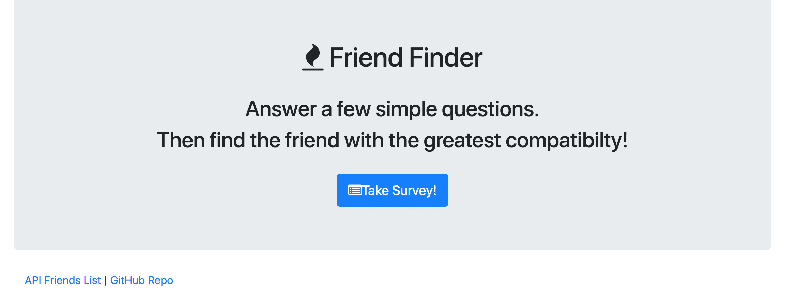
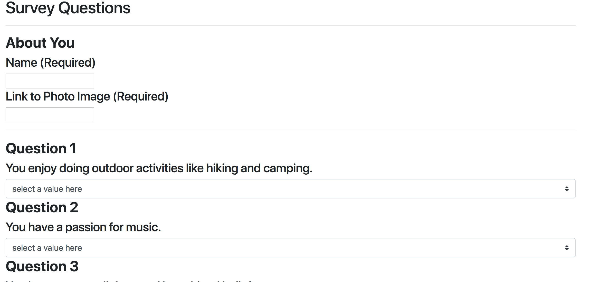

# FriendFinder
An app that allows users to connect or be "matched" with each other based on responses to survey questions and compatibility.
### **Description:**
This is an application that invites users to take a quick survey and then be matched with a friend who has similar interests or responses. Users respond to questions by choosing a rating from 1(Strongly disagree) to 5(Strongly agree). The app then loops through all 'friends' in the friends list (stored on the server) and automatically matches them with another person that has the most similar responses. A modal then shows the user who they got matched with including their new friends name and image.
 
_____
### **Before You Begin**
* Open Terminal or Gitbash
* Clone Repo
* within the directory of the repo, install Node packages:
    * npm install express (https://www.npmjs.com/package/express)
    * npm install path (https://www.npmjs.com/package/path) 
_____
### **How to Run the Apps**
1. open file directory in the terminal or Gitbash
2. type the following in the command line:  **node filename** 
    * Filename is 'server.js'
3. The terminal should alert user that the server 'is listening on PORT 8080'.
    * This must be displayed in order for the app to display in the browser.
4. From the FriendFinder home-page, users can click the button, 'take survey' to begin.
5. From the FriendFinder survey-page, users can input their name and a link to their image, then begin answering the 10 questions. All fields are required to be completed in order for a user to be matched with a friend.
 
_____
### **Demo Screenshots**
#####FriendFinder
* This is what the home-page looks like!

* This is what the survey page looks like!

* This is what the match modal displays!

_________
### **Technologies Used**
* Node.js
* Express
* HTML5
* JavaScript
* Express NPM package (https://www.npmjs.com/package/express)
* mysql NPM path (https://www.npmjs.com/package/path) 
_____
### **Built With**
* Visual Studio Code
* Terminal/Gitbash
